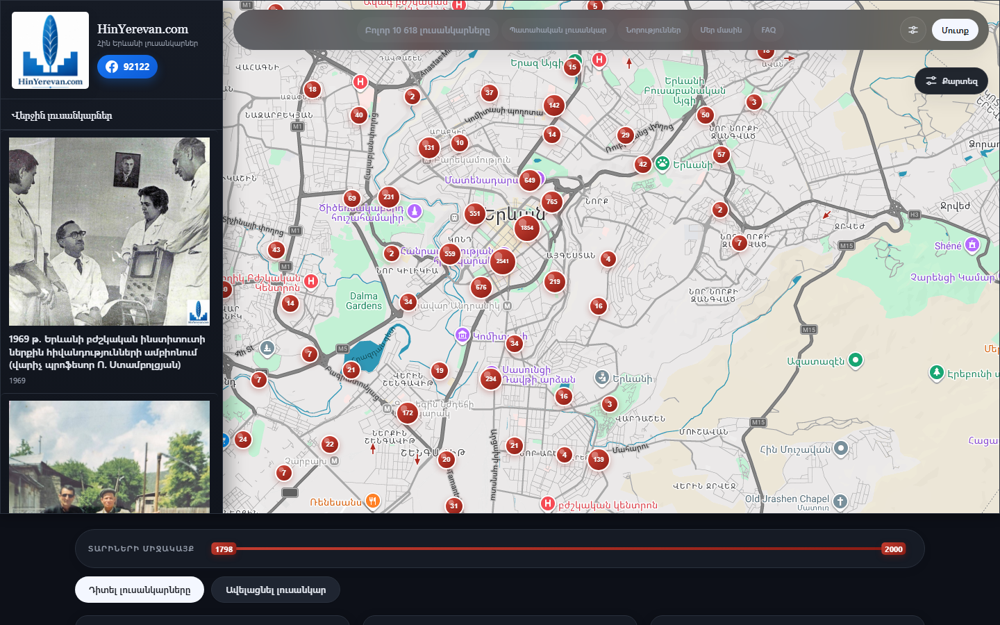
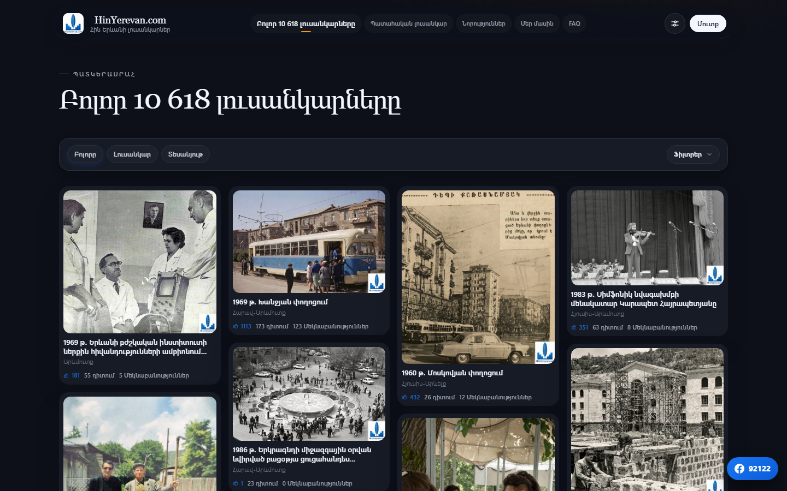
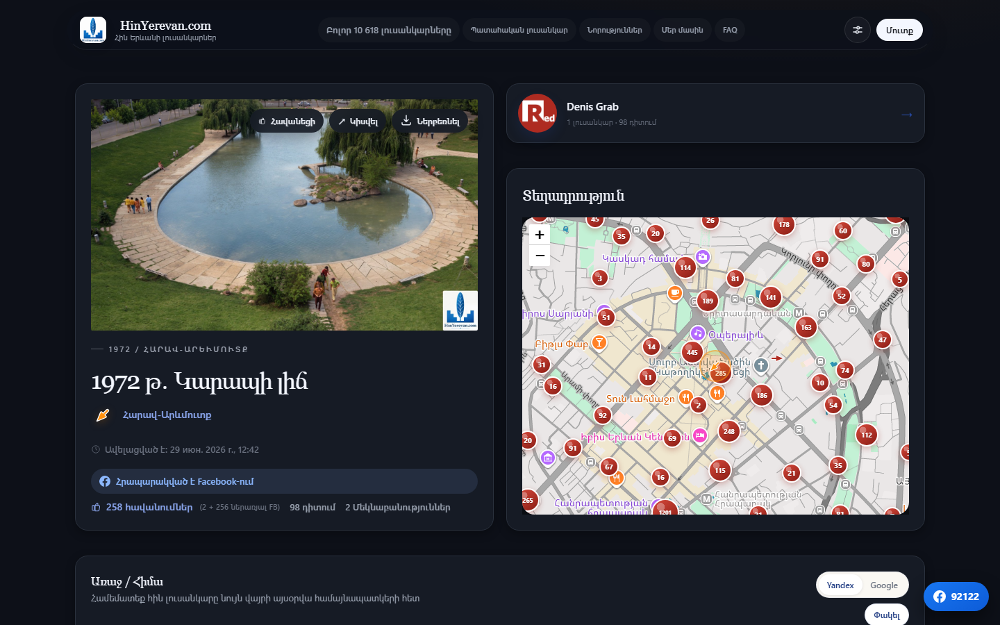
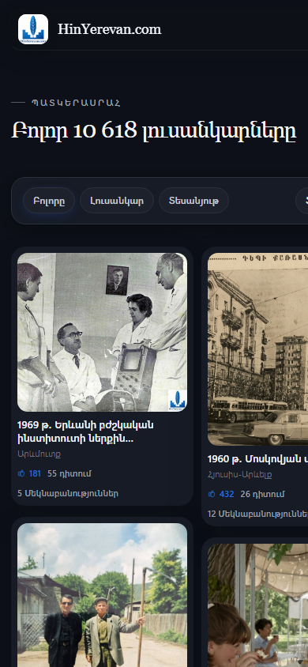

<div align="center">

# HinYerevan.com

**Архив старых фотографий Еревана** — более 10 600 снимков на интерактивной карте города,
с фильтрами по годам, авторам и местам, комментариями и живой интеграцией с Facebook.

[hinyerevan.com](https://hinyerevan.com) · [Facebook-страница](https://www.facebook.com/HinYerevanCom/) (92 000+ подписчиков)

</div>

---

## Как это выглядит

### Карта города
Каждая точка — фотография, привязанная к месту съёмки и направлению камеры.
Слева лента последних поступлений, снизу — фильтр по диапазону лет.



### Каталог
Сетка с бесконечной прокруткой, фильтры по типу (фото/видео), году, автору и направлению.



### Карточка фотографии
Год, место на мини-карте, автор, счётчики лайков и просмотров (сайт + Facebook),
сравнение «тогда/сейчас», комментарии и связанные снимки поблизости.



### Мобильная версия

<div align="center">
  
</div>

---

## Стек

| Слой | Технологии |
|---|---|
| **Backend** | Laravel 10, PHP 8.1, MySQL, Sanctum (токены), Socialite (OAuth) |
| **Frontend** | Vue 3 + Vite, Vue Router, SCSS, Leaflet + markercluster |
| **Инфраструктура** | Nginx + php-fpm на VPS, Let's Encrypt, Cloudflare, Brevo (SMTP) |
| **Языки** | Армянский, русский, английский |

## Возможности

**Фотоархив**
- Загрузка с гео-привязкой, направлением камеры, годом и модерацией
- Вотермарка, пропорциональная размеру снимка, наносится автоматически
- Видео с YouTube — воспроизведение прямо в карточках, каталоге и попапах карты
- Панорама «тогда/сейчас» и подборка снимков поблизости

**Сообщество**
- Комментарии с ветками ответов и лайками
- Профили с рейтингами, коллекцией избранного и статистикой
- Вход через email или соцсети (Google, Facebook, Яндекс, VK, OK, Mail.ru)
- К одному аккаунту можно привязать несколько соцсетей

**Интеграция с Facebook**
- Публикация фотографий на страницу; видео уходят карточкой-плеером
- Двусторонняя синхронизация комментариев и лайков через Graph API
- Импорт постов со страницы в админку — списком или за выбранный период
- Токен страницы обновляется автоматически, картинки кэшируются локально

**Админка**
- Модерация фотографий, управление пользователями, новостями и обратной связью
- Очередь постов из Facebook с импортом в один клик

## Структура

```
backend/    Laravel API — контроллеры, модели, сервисы Facebook, миграции
frontend/   Vue 3 SPA — views, components, i18n, стили
deploy/     Скрипты и заметки: Nginx, Cloudflare, SSL, почта, бэкапы
docs/       Скриншоты для README
```

## Локальный запуск

```bash
# backend
cd backend
composer install
cp .env.example .env && php artisan key:generate
php artisan migrate
php artisan serve
```

```bash
# frontend
cd frontend
npm install
npm run dev
```

## Деплой

Прод разворачивается с ветки `dev`. Скрипт подтягивает код, ставит зависимости,
прогоняет миграции и собирает фронтенд:

```bash
ssh root@<vps> "bash /var/www/hinyerevan/deploy/deploy-dev.sh"
```

Разовая настройка планировщика и Cloudflare — `deploy/setup-cron.sh` и `deploy/setup-cloudflare.sh`.

> **Секреты** передаются только через переменные окружения и `.env` на сервере.
> В репозитории их быть не должно.

## Известные ограничения

- **Имена авторов комментариев из Facebook** не отображаются, пока приложению не выдан
  Advanced Access на `pages_read_user_content` — Facebook скрывает поле `from` от приложений,
  не прошедших App Review.
- **Публикация от имени пользователя** в Facebook невозможна: разрешение `publish_actions`
  отключено платформой в 2018 году, посты и комментарии уходят от имени страницы.
- **Просмотры постов** Graph API для обычных постов страницы не отдаёт.
